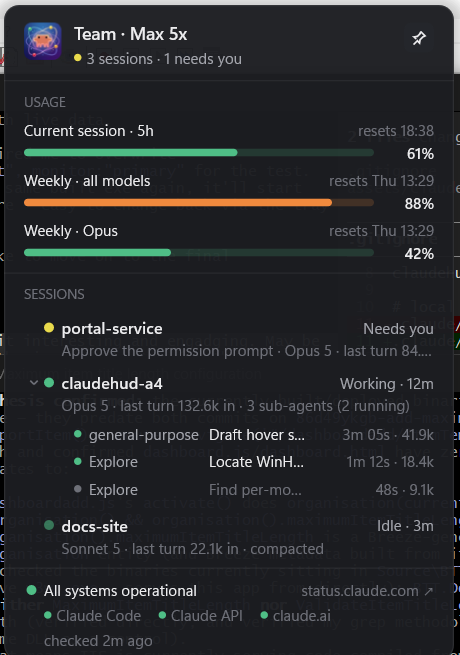

<p align="center">
  
</p>

<h1 align="center">ClaudeHUD</h1>
<p align="center">
  <b>A 4-pixel light on the edge of your screen that always knows what Claude Code is doing.</b>
</p>
<p align="center">
  No hooks. No wrapper scripts. No Electron. Just a tiny native Windows tray app,
  under 1&nbsp;MB, that watches your Claude Code sessions and tells you — at a glance —
  whether something needs you.
</p>

<p align="center">
  
</p>

---

## The problem

You're deep in something else — another window, another monitor, a meeting — while three
Claude Code sessions are running in the background. One of them finishes and asks a question.
One of them hits a permission prompt. One of them just quietly burns through your weekly quota.
You have no idea, because nothing tells you, until you tab back over and find a wall of
"waiting for your response."

ClaudeHUD is a single, silent pixel strip that answers one question at a glance:
**does anything need me right now?**

## The light

A thin, rounded pill sits flush against one edge of your screen. It never moves, never
animates, never steals focus — it just changes colour.

| | Colour | Meaning |
|---|---|---|
| ⚫ | **Off** | No Claude session running. The strip disappears entirely. |
| 🟢 | **Green** | A session is running. Full brightness while it's working, dimmed to 55% the moment everything goes idle. |
| 🟡 | **Yellow** | Something needs you — a permission prompt, a question, a plan waiting on approval. |
| 🟠 | **Amber** | A usage or spend limit is almost gone (default: 85%+). |
| 🔴 | **Red** | A limit is fully spent, an API call is failing, a session died mid-turn, or Claude's own status page reports trouble. |

Priority is always **red > yellow > amber > green > off** — if three things are true at once,
the strip shows the one that matters most. Colours were picked and validated for colour-blind
accessibility (ΔE ≥ 12.3 even under simulation), and colour is never the *only* signal — every
state has matching text in the tooltip and panel.

## Hover for the whole story

The light is the headline; hovering it — or the tray icon — slides out the full picture.

<p align="center">
  
</p>

One glance tells you:

- **Every session**, ordered by what needs attention first — waiting, then working, then idle —
  with elapsed time, model, last-turn token count, and its working folder on hover.
- **Sub-agents**, nested under the session that spawned them, running/done/failed at a glance.
- **Usage and spend**, per window (5-hour, weekly, weekly-Opus, or a monthly spend cap for
  Enterprise plans), each with its own progress meter and reset time.
- **Claude's own service status** — Claude Code, the API, and claude.ai — right in the footer,
  so a red strip never leaves you guessing whether it's your quota or an outage.

Click a session to expand its sub-agents. Click the pin (or the strip itself) to keep the panel
open. It never takes focus from whatever you were doing — you can keep typing while it's open.

## Why it's built this way

- **Zero footprint on Claude Code.** No hooks, no settings.json edits, no wrapper around the
  `claude` binary. ClaudeHUD only *reads* — the session registry Claude Code already maintains,
  the transcript files it already writes, and the same usage API `claude` itself calls.
- **Actually portable.** One `.exe`, under 1 MB, no installer, no runtime to bundle. Copy it to a
  USB stick and it runs.
- **Genuinely lightweight.** Direct2D and DirectWrite ship with Windows; WinHTTP ships with
  Windows; there's no Electron, no WebView2, no bundled browser engine. Idle CPU is effectively
  zero — one timer tick a second, two HTTP calls every five minutes.
- **No time-based lies.** A 20-minute build is still green. ClaudeHUD never guesses "stuck" from
  elapsed time; every colour traces back to a fact Claude Code itself reported.

## Getting started

```powershell
git clone <this repo>
cd ClaudeHUD
cargo build --release
.\target\release\claudehud.exe
```

That's it — no configuration required. Right-click the tray icon for edge/monitor/warning-threshold
settings, "Run on startup," and the exit command. Requires Windows 10 or 11 and a Rust toolchain to
build (`x86_64-pc-windows-msvc`).

Want to see it react to fake data before pointing it at your real sessions?

```powershell
$env:CLAUDEHUD_FIXTURE = (Resolve-Path fixtures\snapshots\yellow_waiting_beats_amber.json).Path
cargo run --release
```

## Under the hood

Rust, `windows-rs`, and nothing else you'd notice: no async runtime, no HTTP client crate, no
GUI framework. The strip and panel are hand-rolled layered windows painted with Direct2D; usage
and status come over WinHTTP on a background thread; the whole colour-decision engine is one
pure function (`fold()`) covered by golden-file tests, so every rule in the table above is
pinned down and regression-tested, not just eyeballed.

150+ automated tests — parser fixtures for every real file shape Claude Code writes, a hover
state-machine table test, panel-layout assertions, and golden snapshots for every colour rule —
plus a Win32 smoke test that launches the real exe and checks it never steals focus.

Curious how deep the rabbit hole goes? [`PLAN-CLAUDEHUD.md`](PLAN-CLAUDEHUD.md) is the full design
spec; [`docs/plans/claudehud/`](docs/plans/claudehud/) is the task-by-task implementation plan it
was built from, end to end, by an AI pair-programming session that documented its own decisions,
deviations, and dead ends along the way.

## Status

Feature-complete against the v1 spec and passing its own release checklist. Still a young
project — see [`docs/manual-checklist.md`](docs/manual-checklist.md) and
[`docs/manual-qa-pending.md`](docs/manual-qa-pending.md) for what's been verified by hand versus
what's still waiting on a human to click through it.

---

<p align="center"><i>A quiet light for a loud amount of work happening just out of sight.</i></p>
